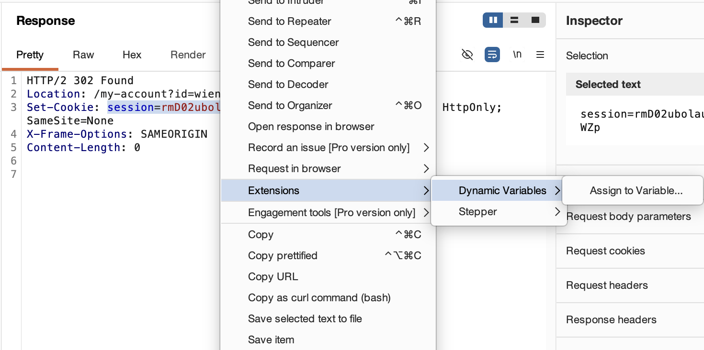

# Dynamic Variables — Burp Suite Extension

**English** | [Español](README_ES.md)

> **Placeholder-based request variables for Repeater, Intruder, Scanner and Proxy with transparent auto-refreshing on session expiration (401/403) in Burp Suite.**

Dynamic Variables is a Burp Suite extension that brings template variables and automatic session refreshes to your pentesting workflow. Define placeholders like `{{token}}` in Repeater, Intruder, Scanner, or Proxy requests (similar to how it is done in Postman), optionally require a custom tag such as `{{dv:token}}` to avoid collisions with security payloads, select text in HTTP responses to auto-generate regex extraction rules, and repeat login/refresh requests automatically in the background when your session expires.

---

## Index

- [Features](#features)
- [Screenshots](#screenshots)
- [How to Use](#how-to-use)
- [Use Cases for Pentesters](#use-cases-for-pentesters)
- [Installation](#installation)
- [Running the Test Suite](#running-the-test-suite)
- [Dependencies](#dependencies)
- [Contributing](#contributing)
- [Acknowledgements](#acknowledgements)
- [License](#license)

---

## Features

| # | Feature | Description |
|---|---------|-------------|
| 1 | **Placeholder Substitution** | Scans outgoing requests in **Repeater**, **Intruder**, **Scanner**, and **Proxy** for active placeholder templates and replaces them with their actual values in real-time. |
| 2 | **Regex Auto-Deduction** | Highlight any token (JWT, cookie, JWE, anti-CSRF) in a response, right-click, and select *Assign to Variable...*. The scanner auto-generates the matching regex for JSON keys, query params, or XML tags. |
| 3 | **Variables Dashboard** | A centralized tab in Burp Suite to manage variable values, auto-extraction rules, and background request execution. Includes independent toggles to enable/disable substitution in Repeater, Intruder, Scanner, and Proxy. |
| 4 | **Request Auto-Refreshing** | Saves the request template that generated your token (e.g., login or auth endpoint). Re-sends it instantly in a background thread from the tab to fetch a fresh token. |
| 5 | **Recursive Injection** | If your saved refresh request itself depends on other variables (like credentials or client keys), they are substituted automatically before launching the request. |
| 6 | **Per-variable Session Recovery** | Recovery is available by default in Repeater, but each variable must explicitly opt in and have a saved refresh request. Safe methods are allowed by default; other methods require an additional per-variable permission. |
| 7 | **Interactive Rule Editor** | Click *Update Rule from Response...* to run the saved request and highlight the new token value directly in a raw HTTP response editor to auto-update the regex rule. |
| 8 | **Repeater Integration** | Send your saved login/refresh requests directly to the Repeater tab for manual tweaking and testing. |
| 9 | **Request Editor Sub-Tab** | Adds a custom request editor tab next to Raw/Hex to display a sidebar listing all defined variables. Double-click any variable to insert a placeholder using the active syntax. |
| 10 | **Zero Dependencies** | Built using the native Montoya API. No external libraries, 100% self-contained JAR. |
| 11 | **Variable Folders** | Organize variables by user, session, or context. Folder variables use qualified placeholders such as `{{alice.token}}`, allowing `alice.token` and `bob.token` to coexist safely. |
| 12 | **Request Folder Switching** | Replace every matching placeholder from one folder with its counterpart in another folder directly from a request's context menu. |
| 13 | **Materialize Repeater Variables** | Preview and permanently replace all known placeholders in an editable Repeater request with their current text values for direct testing without variables. |
| 14 | **Configurable Placeholder Tag** | Optionally require a custom tag such as `dv` so only `{{dv:variable_name}}` is substituted and unrelated `{{...}}` pentesting payloads remain untouched. |
| 15 | **English and Spanish Interface** | Choose the language used throughout the extension from **Configuration...**. English is used by default and the selected language is saved between Burp sessions. |
| 16 | **Multiple-value Extraction** | Enable an optional multiple-value mode while assigning a variable. Each named value keeps its own selection, source, and regex, and an editable template such as `{{value1}}; {{value2}}` composes the parent value. |
| 17 | **2FA (TOTP) Variables** | Create a variable from **Add...** → **Add 2FA variable** whose value is the 2FA code computed from a Base32 secret. The code is recomputed every time the variable is used instead of rotating continuously in the background. |
| 18 | **Configurable Session Expiry Signal** | Detect expired sessions beyond `401`/`403`. Each rule can define its own **Session expiry signal** combining status codes with response header and body filters, for applications that answer with a `302` to `/login` instead. |

---

## Screenshots

| Dynamic Variables Tab |
|:---:|
|  |

| Assign to Variable (Context Menu) | Variable usage in request |
|:---:|:---:|
|  |  |

---

## How to Use

### 1. Define a Variable Manually
1. Open the **Variables** tab in Burp Suite.
2. Optionally click **New Folder** and create a folder such as `alice`.
3. Click **New Variable** and choose the destination in the **Folder:** selector, which defaults to **Ungrouped**.
4. Enter a name (e.g., `api_key` or `token`). Variable and folder names may only contain letters, numbers and `_`, so spaces and dots are rejected.
5. Select the variable in the table, and paste the value in the **Variable Value Editor** on the right.
6. In Repeater, reference an ungrouped variable as `{{api_key}}` or a grouped variable as `{{alice.token}}`. It will be substituted when the request is sent.

Folders can be expanded or collapsed. Drag variables to reorder them or move them between folders; because moving changes the placeholder, the extension shows the old and new placeholders before applying the move. Right-click a variable to rename it, copy its placeholder, move it, or delete it.

#### Interface Language

English is the default interface language. To use the extension in Spanish:

1. Click **Configuration...** in the Dynamic Variables tab.
2. Select **Spanish** from the **Language** list.
3. Click **OK**.

The dashboard, dialogs, context menus, and request editor controls use the selected language. The preference is stored automatically and restored the next time the extension is loaded. Select **English** from the same list to switch back.

#### Optional: Require a Placeholder Tag

The default syntax remains `{{token}}`, preserving existing projects. To distinguish extension variables from SSTI or other payloads:

1. Click **Configuration...** in the Dynamic Variables tab.
2. Enable **Use a tag in variable placeholders**.
3. Enter a tag such as `dv` or `pentest` and review the example.
4. Save the configuration.

With the tag `dv`, use `{{dv:token}}` or `{{dv:alice.token}}`. Only placeholders with that exact, case-sensitive tag are substituted; `{{token}}`, `{{7*7}}`, and placeholders using another tag are transmitted unchanged. Existing requests are not rewritten automatically. Copying or inserting a variable uses the currently active syntax.

### 2. Auto-Extract Variables from Responses
1. Send a request that returns a token in the response (e.g., login request).
2. Go to the **Response** viewer tab.
3. Highlight the token value inside the response body or headers.
4. Right-click the highlighted text and click **Assign to Variable...**.
5. Search for a folder by typing in the folder field. Select an existing match, keep **Ungrouped**, or create the entered folder without leaving the dialog.
6. In **Variable and configuration**, select or type a variable name and configure the common request and automation settings.
7. Open **Values and extraction**. The **Regex Pattern** for the original selection is automatically generated for you.
8. Keep **Save this request to refresh token in the future** checked if the variable will participate in session recovery.
9. Choose whether to enable passive extraction and expired-session recovery for the variable. Both remain disabled unless selected explicitly.
10. Click **Save Rule**, then review the explicit method, service, path, optional query, and request discriminator in the dashboard.

To build one parent value from several response fragments, enable **Extract multiple values** in the assignment dialog. The original selection becomes `value1`. Click **Add value to extract...**, select another fragment in the displayed HTTP message, and repeat as needed. Use the value selector to switch between `value1`, `value2`, and the remaining extraction rules without displaying every editor at once. The final template is generated as `{{value1}}; {{value2}}`, remains editable, and determines the exact value stored in the parent variable.

### 3. Using the Dynamic Variables Request Tab
1. Open the **Repeater** tab.
2. Under the **Request** viewer panel (where you see *Raw*, *Pretty*, *Hex*), click the **"Dynamic Variables"** tab.
3. You will see:
   - On the left: a list of your variables (e.g. `jwt`, `session_id`).
   - On the right: the raw HTTP request text.
4. Position your cursor in the HTTP request text (e.g., next to `Authorization: Bearer `).
5. **Double-click** the variable `jwt` in the left list (or select it and click **Insert**).
6. The placeholder `{{jwt}}` will be immediately inserted at the cursor position.
7. Click **Send** to transmit the request.

Variables can also be inserted without leaving the request editor. Place the cursor where the placeholder should go, right-click the request and choose **Extensions** → **Dynamic Variables** → **Insert**. The submenu lists one entry per folder, plus **Ungrouped**, and each item shows the placeholder exactly as it will be written using the active syntax. The menu reports **No variables defined** when there is nothing to insert, and asks to *place the cursor in the request first* if no insertion point was selected.

### 4. Switching a Request to Another Variable Folder
1. Open a request containing grouped placeholders, for example `{{user1.jwe}}` and `{{user1.accountId}}`.
2. Right-click anywhere in the request and choose **Change variable folder...**.
3. Select `user1` as the source folder and `user2` as the target folder.
4. Review the preview and click **Apply change**.

Only variables with the same local name in the target folder are changed. For example, if `user2` contains both `jwe` and `accountId`, the request becomes `{{user2.jwe}}` and `{{user2.accountId}}`. A source placeholder without a counterpart in `user2` remains unchanged and is listed in the preview.

#### Using Folders to Test Different Users

Folders are especially useful for representing different authenticated users, roles, or tenants during authorization testing. Create one folder per identity and give equivalent variables the same local names.

For example, the `user1` and `user2` folders can both contain `jwe` and `accountId`. Build the request once using:

`{{user1.jwe}}` and `{{user1.accountId}}`

Then use **Change variable folder...** from the request context menu to switch it to:

`{{user2.jwe}}` and `{{user2.accountId}}`

Only placeholders with a matching variable in the target folder are changed. Placeholders without a counterpart remain untouched and are shown in the preview.

This makes it quick and less error-prone to repeat the same request as another user when testing horizontal or vertical authorization, IDOR/BOLA vulnerabilities, role separation, and multi-tenant isolation.

### 5. Materializing Variables in a Repeater Request
1. Open an editable Repeater request containing placeholders such as `{{token}}` or `{{alice.accountId}}`.
2. Right-click anywhere in the request and choose **Replace variables with their values...**.
3. Review the current values that will be inserted and any unknown placeholders that will remain unchanged.
4. Click **Replace values** to update the request's path, header values, and body.

This modifies the template currently open in Repeater. Once a placeholder has been replaced with text, later updates to that variable no longer affect this request. Duplicate the Repeater tab first or use Repeater's undo support if you may need the original template again.

### 6. Transparent 401/403 Session Recovery
Global recovery is enabled by default only for Repeater. It remains inactive for a variable until that variable explicitly opts in and has a saved refresh request. Stored preferences from an earlier release are preserved.

1. In **Configuration...**, explicitly enable session recovery for the required Burp tools. Repeater is the only preselected tool scope.
2. Enable **Enable automatic session recovery (401/403)** globally.
3. Select the variable and enable **Use this variable for expired-session recovery**.
4. Requests using `GET`, `HEAD`, or `OPTIONS` can now be refreshed and retried after a configured status code.
5. To replay any other method, additionally enable **In session recovery, allow retrying non-idempotent requests** for every variable being refreshed.

Refresh values are staged and committed together. If any refresh fails, the original 401/403 is preserved and no partial values are stored. A successful retry is returned with a Burp annotation recording the original and final status codes. The extension never logs token values, cookies, credentials, or message bodies.

Passive extraction and session recovery have separate per-tool scopes. Rules from different variable folders are treated as different pentest identities; if more than one folder matches the same request, extraction fails closed. Within one folder, multiple values such as access and refresh tokens can be updated together. When concurrent requests use the same rule, only the response belonging to the most recently sent request may update it.

#### Detecting Expiration Beyond 401/403

Many applications do not answer an expired session with `401` or `403`. A classic session cookie often produces a `302` carrying `Location: /login`, and single-page applications frequently return the login page with `200`. For those cases each variable can define its own **Session expiry signal**, inside **Show advanced automation options**:

1. Select the variable and open **Show advanced automation options**.
2. Fill **Expiry status codes:** with the codes that indicate expiration, for example `301, 302`. Leave it empty to accept any status code.
3. Add a **Response header filter:** such as `Location:\s*/login`, or a **Response body filter:** such as `"error":"invalid_token"`.
4. Optionally enable **The session is expired when the filter does NOT match** to invert the verdict of the whole signal, which is useful when expiration is signalled by the *absence* of a marker.

Every populated field must match. Both filters are searched inside the content: **Literal** looks for the text anywhere in the header block or the body, and **Regular expression** searches for a match, with `^` anchoring at each header line. This differs from the path and query filters of passive matching, where **Literal** means an exact comparison.

Status codes other than `401` and `403` require a header or body filter. A bare `302` is ambiguous — logouts and public endpoints redirect too — and without that requirement a rule allowing non-idempotent replay would resend `POST` requests on every ordinary redirect. A signal that does not meet the requirement is ignored and the globally configured status codes are used instead.

A variable without a signal keeps using the status codes from **Configuration...**, so existing rules are unaffected.

> When *follow redirects* is enabled in Repeater, the `302` never reaches the extension because Burp has already followed it. Either disable the option or match the login page with a body filter.

### 7. Creating a 2FA (TOTP) Variable
1. Click **Add...** in the Dynamic Variables tab and choose **Add 2FA variable**.
2. Select the destination in **Folder:** and enter the **Variable name:**.
3. Paste the **2FA Secret (Base32):** provided by the application. Only Base32 characters (`A-Z`, `2-7`) are accepted.
4. Expand **Advanced** only if the service does not use the defaults of `SHA1`, `6` digits and a `30` second period. **Digits:**, **Period (seconds):** and **Algorithm:** are configurable there.
5. Check **Current code:** to confirm the secret produces the expected code, then click **Create**.

The variable is then used like any other placeholder, for example `{{totp}}` or `{{alice.totp}}`. Its value is computed from the secret every time the variable is used, so a request always carries a valid code without any background rotation. **Rotate now** recomputes the code on demand, although the code only changes once its period elapses. A 2FA variable owns its value: it is never extracted from a response nor replayed during session recovery, so the value editor and the automation options are disabled for it.

### 8. Interactive Rule Updating
1. If the API response structure changes, select your variable in the table.
2. Click **Update Rule from Response...**.
3. The plugin fetches a fresh response from the server and displays it in a raw viewer.
4. Highlight the new token location in this viewer to immediately regenerate the regex pattern.
5. Click **Save Extraction Rule** to save changes.

**Edit Request** opens the request editor even when the variable has no saved refresh request yet, starting from a blank `GET /` template so the refresh request can be crafted from scratch instead of having to capture one first.

---

## Use Cases for Pentesters

| Scenario | How it helps |
|----------|--------------|
| **JWT/JWE Rotation** | Set up a regex extraction rule on the login endpoint response. The JWT variable updates dynamically whenever you send a login or authenticate request, updating all active Repeater templates. |
| **Session Cookie Refresh** | Extract cookie headers (`Set-Cookie: session=([^;]+)`) and replace them in all target Repeater tabs using `Cookie: session={{session_cookie}}`. |
| **Active Scanning & Fuzzing** | Run Intruder or Scanner audits using `{{token}}`. Since these tools support the toggles, when the token expires in the middle of a scan, the plugin auto-heals the session and continues the audit seamlessly. |
| **Credential Management** | Store your testing passwords or administrative user logins as variables, and change them once globally to update all your fuzzing/repeating setups. |

---

## Installation

### Requirements
- **Java**: JDK 17 or later
- **Burp Suite**: Any edition compatible with Montoya API (2023.12+)

### Build from Source

The project uses Gradle to produce a clean, lightweight JAR file:

```bash
gradle build
```

The output JAR will be created at:
```
build/libs/dynamic-variables-1.1.0.jar
```

### Load in Burp Suite

1. Open Burp Suite.
2. Go to **Extensions** → **Installed**.
3. Click **Add**.
4. Set **Extension type** to `Java`.
5. Select the compiled `dynamic-variables-1.1.0.jar` file and click **Next**.

## Running the Test Suite

Run the commands from the repository root. The suite uses JUnit 5 and covers placeholder parsing, tagged and untagged substitution, request rewriting, folder remapping, preference persistence, and state migration.

On macOS or Linux, the most reliable command is:

```bash
java -classpath gradle/wrapper/gradle-wrapper.jar org.gradle.wrapper.GradleWrapperMain test
```

On Windows PowerShell or Command Prompt:

```powershell
java -classpath gradle\wrapper\gradle-wrapper.jar org.gradle.wrapper.GradleWrapperMain test
```

The standard Gradle wrapper commands can also be used:

```bash
./gradlew test        # macOS/Linux
```

```powershell
gradlew.bat test      # Windows
```

If `./gradlew` reports a classpath or `sed` error when the repository path contains spaces, use the direct `java -classpath ...` command shown above.

To force every test to run again without reusing Gradle task results:

```bash
java -classpath gradle/wrapper/gradle-wrapper.jar org.gradle.wrapper.GradleWrapperMain test --rerun-tasks
```

To run the suite and produce the extension JAR in one invocation:

```bash
java -classpath gradle/wrapper/gradle-wrapper.jar org.gradle.wrapper.GradleWrapperMain test jar
```

A successful run ends with `BUILD SUCCESSFUL`. Gradle writes the browsable report to `build/reports/tests/test/index.html` and the machine-readable JUnit XML results to `build/test-results/test/`.

---

## Contributing

We welcome contributions from human developers and AI assistants alike! Before making changes or submitting a Pull Request, please review the developer documentation located in the `dev/` directory:

- **[`dev/AGENTS.md`](dev/AGENTS.md)**: Contains project architecture details, code conventions, build/test commands, and strict development guidelines.
- **[`dev/BAPP_STORE_CHECKLIST.md`](dev/BAPP_STORE_CHECKLIST.md)**: Checklists and verification steps covering PortSwigger's 12 BApp Store Acceptance Criteria.

### Pull Request Requirements

1. **Test Verification**: Ensure all unit tests pass cleanly by running `./gradlew test`.
2. **GUI Responsiveness**: Never perform slow I/O or network calls on Swing's Event Dispatch Thread (EDT). Use background threads (`new Thread(...)`).
3. **Burp Networking**: Use Montoya's `api.http().sendRequest(...)` for all external HTTP communications, so Burp's upstream proxies, TLS settings and session handling rules apply.
4. **Parent Containers for UI Dialogs**: Always specify `api.userInterface().swingUtils().suiteFrame()` as the parent window for modal dialogs or popups (`JDialog`, `JOptionPane`).
5. **Clean Environment**: Do not commit local file system paths or confidential environment data.

---

## Acknowledgements

Special thanks to **[Mario Mansilla (@creep33)](https://github.com/creep33)** for his outstanding contributions to the project:
- Reporting the bug that caused the session refresh request to run even when the refresh option was disabled, and suggesting the *Pretty* format instead of *Raw* in request dialogs.
- Designing and implementing major features and enhancements, including:
  - **2FA (TOTP) Variables**: On-demand calculation of 2FA codes from Base32 secrets (RFC 6238/4226) without background timers.
  - **Context Menu Variable Insertion**: Inserting placeholders directly from the editor's right-click menu, grouped by folders.
  - **Configurable Session Expiry Signals**: Fine-grained expiry detection matching HTTP status codes, header filters, body filters, and logical inversion.
  - **Folder Selector on Creation**: Assigning variables to folders directly upon creation.
  - **Networking & Usability Improvements**: Routing multi-value extraction requests through Burp's Montoya HTTP engine, crafting refresh requests from scratch, strict variable name validation (`[A-Za-z0-9_]+`), custom folder rename fix, and Enter key confirmations for dialogs.

---

## License

This project is licensed under the **MIT License**.
See [LICENSE](LICENSE) for details.
