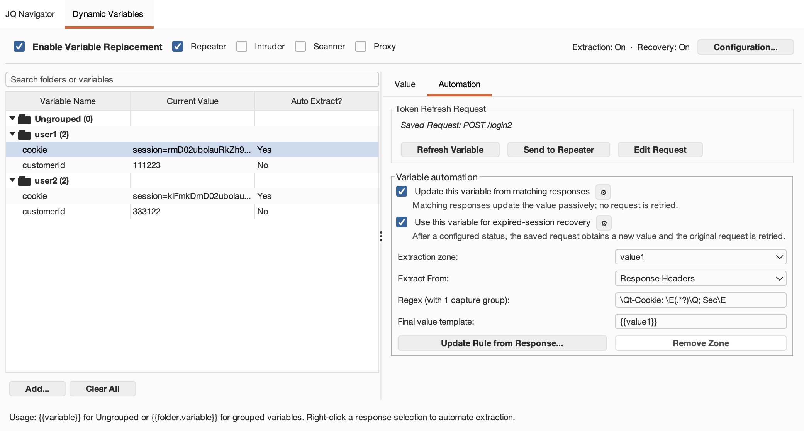
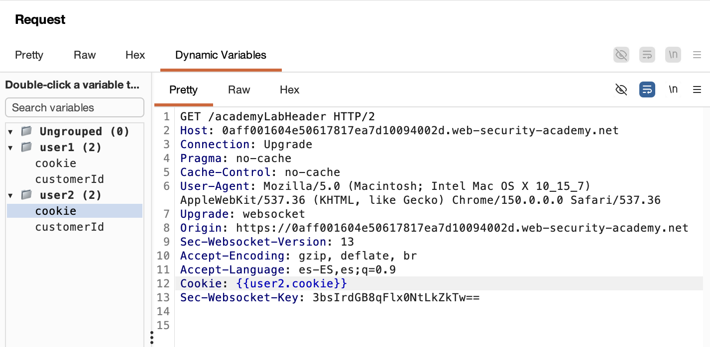

# Dynamic Variables — Extensión para Burp Suite

[English](README.md) | **Español**

> **Variables para peticiones basadas en placeholders en Repeater, Intruder, Scanner y Proxy, con actualización automática y transparente cuando la sesión caduca (401/403) en Burp Suite.**

Dynamic Variables es una extensión para Burp Suite que incorpora variables de plantilla y actualización automática de sesiones a tu flujo de pentesting. Permite definir placeholders como `{{token}}` en peticiones de Repeater, Intruder, Scanner o Proxy —de forma parecida a Postman—, exigir opcionalmente una etiqueta personalizada como `{{dv:token}}` para evitar colisiones con payloads, seleccionar texto en respuestas HTTP para generar automáticamente reglas de extracción mediante regex y repetir peticiones de login o actualización en segundo plano cuando la sesión caduca.

---

## Índice

- [Características](#características)
- [Capturas de pantalla](#capturas-de-pantalla)
- [Cómo utilizarla](#cómo-utilizarla)
- [Casos de uso para pentesters](#casos-de-uso-para-pentesters)
- [Instalación](#instalación)
- [Ejecución de las pruebas](#ejecución-de-las-pruebas)
- [Dependencias](#dependencias)
- [Cómo colaborar](#cómo-colaborar)
- [Agradecimientos](#agradecimientos)
- [Licencia](#licencia)

---

## Características

| # | Característica | Descripción |
|---|----------------|-------------|
| 1 | **Sustitución de placeholders** | Busca plantillas de placeholders activas en las peticiones salientes de **Repeater**, **Intruder**, **Scanner** y **Proxy**, y las sustituye por sus valores reales en tiempo real. |
| 2 | **Deducción automática de regex** | Selecciona cualquier token (JWT, cookie, JWE o anti-CSRF) en una respuesta, haz clic derecho y elige *Asignar a variable...*. La extensión genera automáticamente el regex correspondiente para claves JSON, parámetros de consulta o etiquetas XML. |
| 3 | **Panel de variables** | Una pestaña centralizada en Burp Suite para administrar valores, reglas de extracción automática y ejecución de peticiones en segundo plano. Incluye controles independientes para activar o desactivar la sustitución en Repeater, Intruder, Scanner y Proxy. |
| 4 | **Actualización automática de peticiones** | Guarda la plantilla de la petición que generó el token, como un endpoint de login o autenticación. La vuelve a enviar inmediatamente desde la pestaña y en segundo plano para obtener un token nuevo. |
| 5 | **Inyección recursiva** | Si la petición de actualización guardada depende de otras variables, como credenciales o claves de cliente, estas se sustituyen automáticamente antes de enviar la petición. |
| 6 | **Recuperación de sesión por variable** | La recuperación está disponible por defecto en Repeater, pero cada variable debe activarla explícitamente y tener una petición de actualización guardada. Los métodos seguros se permiten por defecto; el resto requiere un permiso adicional por variable. |
| 7 | **Editor interactivo de reglas** | Pulsa *Actualizar regla desde respuesta...* para ejecutar la petición guardada y seleccionar el nuevo valor del token directamente en un editor de respuesta HTTP sin procesar. La regla regex se actualiza automáticamente. |
| 8 | **Integración con Repeater** | Envía las peticiones guardadas de login o actualización directamente a una pestaña de Repeater para modificarlas y probarlas manualmente. |
| 9 | **Subpestaña del editor de peticiones** | Añade una pestaña personalizada junto a Raw/Hex con una barra lateral que muestra todas las variables definidas. Haz doble clic en una variable para insertar un placeholder con la sintaxis activa. |
| 10 | **Sin dependencias** | Construida con la API Montoya nativa. El JAR es completamente autónomo y no necesita bibliotecas externas en tiempo de ejecución. |
| 11 | **Carpetas de variables** | Organiza las variables por usuario, sesión o contexto. Las variables agrupadas utilizan placeholders cualificados como `{{alice.token}}`, lo que permite que `alice.token` y `bob.token` coexistan de forma segura. |
| 12 | **Cambio de carpeta en peticiones** | Sustituye desde el menú contextual todos los placeholders coincidentes de una carpeta por sus equivalentes de otra. |
| 13 | **Materialización de variables en Repeater** | Previsualiza y sustituye permanentemente todos los placeholders conocidos de una petición editable de Repeater por sus valores de texto actuales. |
| 14 | **Etiqueta de placeholder configurable** | Permite exigir una etiqueta personalizada como `dv`, de modo que solo se sustituya `{{dv:variable_name}}` y los demás payloads de pentesting con formato `{{...}}` permanezcan intactos. |
| 15 | **Interfaz en inglés y español** | Permite elegir el idioma de toda la extensión desde **Configuración...**. El idioma predeterminado es inglés y la selección se conserva entre sesiones de Burp. |
| 16 | **Extracción de múltiples valores** | Activa un modo múltiple opcional al asignar una variable. Cada valor nombrado conserva su selección, origen y regex, y una plantilla editable como `{{valor1}}; {{valor2}}` compone el valor de la variable padre. |
| 17 | **Variables 2FA (TOTP)** | Crea una variable desde **Añadir...** → **Añadir variable 2FA** cuyo valor es el código 2FA calculado a partir de un secreto Base32. El código se recalcula cada vez que se usa la variable, en lugar de rotar continuamente en segundo plano. |
| 18 | **Señal de expiración de sesión configurable** | Detecta sesiones caducadas más allá de `401`/`403`. Cada regla puede definir su propia **Señal de expiración de sesión**, combinando códigos de estado con filtros de cabecera y cuerpo de la respuesta, para aplicaciones que responden con un `302` hacia `/login`. |

---

## Capturas de pantalla

| Pestaña Dynamic Variables |
|:---:|
|  |

| Asignar a variable (menú contextual) | Uso de una variable en una petición |
|:---:|:---:|
|  |  |

---

## Cómo utilizarla

### 1. Definir una variable manualmente

1. Abre la pestaña **Dynamic Variables** en Burp Suite.
2. Opcionalmente, pulsa **Nueva carpeta** y crea una carpeta como `alice`.
3. Pulsa **Nueva variable** y elige el destino en el selector **Carpeta:**, que viene en **Sin carpeta** por defecto.
4. Introduce un nombre, por ejemplo `api_key` o `token`. Los nombres de variables y carpetas solo pueden contener letras, números y `_`, por lo que se rechazan los espacios y los puntos.
5. Selecciona la variable en la tabla y pega su valor en el **Editor de valor de variable** de la derecha.
6. En Repeater, referencia una variable sin carpeta mediante `{{api_key}}` o una variable agrupada mediante `{{alice.token}}`. El placeholder se sustituirá al enviar la petición.

Las carpetas se pueden expandir o contraer. Arrastra las variables para reordenarlas o moverlas entre carpetas. Como el movimiento cambia el placeholder, la extensión muestra los placeholders anterior y nuevo antes de aplicar el cambio. Haz clic derecho sobre una variable para renombrarla, copiar su placeholder, moverla o eliminarla.

#### Idioma de la interfaz

El inglés es el idioma predeterminado. Para utilizar la extensión en español:

1. Pulsa **Configuration...** en la pestaña Dynamic Variables.
2. Selecciona **Spanish** en la lista **Language**.
3. Pulsa **OK**.

El panel, los diálogos, los menús contextuales y los controles del editor de peticiones pasarán a utilizar español. La preferencia se guarda automáticamente y se restaura la próxima vez que se cargue la extensión. Para volver al inglés, abre **Configuración...**, selecciona **Inglés** y confirma el cambio.

#### Opcional: exigir una etiqueta en los placeholders

La sintaxis predeterminada sigue siendo `{{token}}`, lo que mantiene la compatibilidad con proyectos existentes. Para distinguir las variables de la extensión de payloads SSTI u otros payloads:

1. Pulsa **Configuración...** en la pestaña Dynamic Variables.
2. Activa **Usar una etiqueta en los placeholders de variables**.
3. Introduce una etiqueta como `dv` o `pentest` y revisa el ejemplo.
4. Guarda la configuración.

Con la etiqueta `dv`, utiliza `{{dv:token}}` o `{{dv:alice.token}}`. Solo se sustituyen los placeholders que contienen exactamente esa etiqueta, respetando mayúsculas y minúsculas. `{{token}}`, `{{7*7}}` y los placeholders con otra etiqueta se transmiten sin cambios. Las peticiones existentes no se reescriben automáticamente. Al copiar o insertar una variable se utiliza la sintaxis activa en ese momento.

### 2. Extraer automáticamente variables de las respuestas

1. Envía una petición que devuelva un token en la respuesta, por ejemplo una petición de login.
2. Abre la pestaña **Response** del visor.
3. Selecciona el valor del token en el cuerpo o las cabeceras de la respuesta.
4. Haz clic derecho sobre el texto seleccionado y pulsa **Asignar a variable...**.
5. Busca una carpeta escribiendo en el campo. Selecciona una coincidencia existente, conserva **Sin carpeta** o crea la carpeta introducida sin salir del diálogo.
6. En **Variable y configuración**, selecciona o escribe el nombre y configura la petición y la automatización comunes.
7. Abre **Valores y extracción**. El **Patrón regex** de la selección original se genera automáticamente.
8. Mantén marcada **Guardar esta petición para actualizar el token en el futuro** si la variable participará en la recuperación de sesión.
9. Elige si quieres activar la extracción pasiva y la recuperación de sesiones caducadas para la variable. Ambas permanecen desactivadas si no se seleccionan explícitamente.
10. Pulsa **Guardar regla** y revisa en el panel el método, servicio, ruta, query opcional y discriminador de petición explícitos.

Para construir una variable padre a partir de varios fragmentos de la respuesta, activa **Extraer múltiples valores** en el diálogo de asignación. La selección original pasa a ser `valor1`. Pulsa **Añadir valor que extraer...**, selecciona otro fragmento en el mensaje HTTP mostrado y repite el proceso. Utiliza el selector de valores para cambiar entre `valor1`, `valor2` y las demás reglas sin mostrar todos los editores a la vez. La plantilla final se genera como `{{valor1}}; {{valor2}}`, se puede editar y determina exactamente el valor almacenado en la variable padre.

### 3. Utilizar la pestaña Dynamic Variables del editor de peticiones

1. Abre la pestaña **Repeater**.
2. En el panel **Request**, donde aparecen *Raw*, *Pretty* y *Hex*, abre la pestaña **Dynamic Variables**.
3. Verás:

   - A la izquierda, una lista de variables como `jwt` o `session_id`.
   - A la derecha, el texto de la petición HTTP sin procesar.

4. Coloca el cursor en el texto de la petición, por ejemplo después de `Authorization: Bearer `.
5. Haz **doble clic** sobre la variable `jwt` de la lista izquierda, o selecciónala y pulsa **Insertar**.
6. El placeholder `{{jwt}}` se insertará inmediatamente en la posición del cursor.
7. Pulsa **Send** para transmitir la petición.

Las variables también pueden insertarse sin salir del editor de peticiones. Coloca el cursor donde deba ir el placeholder, haz clic derecho sobre la petición y selecciona **Extensions** → **Dynamic Variables** → **Insertar**. El submenú muestra una entrada por carpeta, además de **Sin carpeta**, y cada elemento presenta el placeholder tal y como se escribirá con la sintaxis activa. El menú indica **No hay variables definidas** cuando no hay nada que insertar, y pide *colocar el cursor en la petición primero* si no se ha seleccionado un punto de inserción.

### 4. Cambiar una petición a otra carpeta de variables

1. Abre una petición que contenga placeholders agrupados, por ejemplo `{{user1.jwe}}` y `{{user1.accountId}}`.
2. Haz clic derecho en cualquier punto de la petición y selecciona **Cambiar carpeta de variables...**.
3. Selecciona `user1` como carpeta de origen y `user2` como carpeta de destino.
4. Revisa la vista previa y pulsa **Aplicar cambio**.

Solo se modifican las variables que tengan el mismo nombre local en la carpeta de destino. Por ejemplo, si `user2` contiene tanto `jwe` como `accountId`, la petición pasará a utilizar `{{user2.jwe}}` y `{{user2.accountId}}`. Un placeholder de origen sin equivalente en `user2` permanece intacto y aparece en la vista previa.

#### Utilizar carpetas para probar usuarios diferentes

Las carpetas son especialmente útiles para representar distintos usuarios autenticados, roles o tenants durante las pruebas de autorización. Crea una carpeta por identidad y asigna los mismos nombres locales a las variables equivalentes.

Por ejemplo, las carpetas `user1` y `user2` pueden contener las variables `jwe` y `accountId`. Construye la petición una sola vez utilizando:

`{{user1.jwe}}` y `{{user1.accountId}}`

Después utiliza **Cambiar carpeta de variables...** en el menú contextual de la petición para cambiarla a:

`{{user2.jwe}}` y `{{user2.accountId}}`

Solo se modifican los placeholders que tengan una variable equivalente en la carpeta de destino. Los placeholders sin equivalente permanecen intactos y se muestran en la vista previa.

Esto permite repetir rápidamente la misma petición como otro usuario y reduce el riesgo de errores al probar autorización horizontal o vertical, vulnerabilidades IDOR/BOLA, separación de roles y aislamiento entre tenants.

### 5. Materializar variables en una petición de Repeater

1. Abre una petición editable de Repeater con placeholders como `{{token}}` o `{{alice.accountId}}`.
2. Haz clic derecho en cualquier punto de la petición y selecciona **Sustituir variables por sus valores...**.
3. Revisa los valores actuales que se insertarán y los placeholders desconocidos que permanecerán intactos.
4. Pulsa **Sustituir valores** para actualizar la ruta, las cabeceras y el cuerpo de la petición.

Esta acción modifica la plantilla abierta en Repeater. Cuando un placeholder se sustituye por texto, las actualizaciones posteriores de la variable dejan de afectar a esa petición. Duplica primero la pestaña de Repeater o utiliza la función de deshacer si puedes necesitar la plantilla original más adelante.

### 6. Recuperación transparente de sesiones 401/403

La recuperación global está activada por defecto solo para Repeater. No actúa sobre una variable hasta que esta la active explícitamente y tenga una petición de actualización guardada. Las preferencias almacenadas de versiones anteriores se conservan.

1. En **Configuración...**, activa explícitamente la recuperación para las herramientas de Burp necesarias. Repeater es el único ámbito preseleccionado.
2. Activa globalmente **Activar recuperación automática de sesión (401/403)**.
3. Selecciona la variable y activa **Usar esta variable para recuperar sesiones caducadas**.
4. Las peticiones `GET`, `HEAD` y `OPTIONS` podrán actualizarse y reenviarse después de uno de los códigos configurados.
5. Para reenviar cualquier otro método, activa además **En la recuperación de sesión, permitir reintentar peticiones no idempotentes** en todas las variables que vayan a actualizarse.

Los valores actualizados se preparan y confirman conjuntamente. Si falla cualquiera de las actualizaciones, se conserva el 401/403 original y no se guarda ningún valor parcial. Un reintento correcto se devuelve con una anotación de Burp que indica los códigos de estado original y final. La extensión nunca escribe en los logs tokens, cookies, credenciales ni cuerpos de mensajes.

La extracción pasiva y la recuperación tienen ámbitos de herramientas independientes. Las reglas de carpetas distintas representan identidades de pentest diferentes; si más de una carpeta coincide con una petición, la extracción se detiene de forma segura. Dentro de una carpeta pueden actualizarse conjuntamente varios valores, como access y refresh tokens. Si hay peticiones concurrentes para la misma regla, sólo puede actualizarla la respuesta de la petición enviada más recientemente.

#### Detectar la expiración más allá de 401/403

Muchas aplicaciones no responden con `401` ni `403` cuando la sesión caduca. Una cookie de sesión clásica suele producir un `302` con `Location: /login`, y las aplicaciones de una sola página devuelven con frecuencia la página de login con un `200`. Para esos casos, cada variable puede definir su propia **Señal de expiración de sesión** dentro de **Mostrar opciones avanzadas de automatización**:

1. Selecciona la variable y abre **Mostrar opciones avanzadas de automatización**.
2. Rellena **Códigos de estado de expiración:** con los códigos que indican la caducidad, por ejemplo `301, 302`. Déjalo vacío para aceptar cualquier código.
3. Añade un **Filtro de cabecera de respuesta:** como `Location:\s*/login`, o un **Filtro de cuerpo de respuesta:** como `"error":"invalid_token"`.
4. Opcionalmente activa **La sesión ha expirado cuando el filtro NO coincide** para invertir el veredicto de la señal completa, útil cuando la caducidad se manifiesta por la *ausencia* de un marcador.

Todos los campos rellenos deben coincidir. Ambos filtros se buscan dentro del contenido: **Literal** busca el texto en cualquier punto del bloque de cabeceras o del cuerpo, y **Expresión regular** busca una coincidencia, con `^` anclando en cada línea de cabecera. Esto se diferencia de los filtros de ruta y query del emparejamiento pasivo, donde **Literal** significa una comparación exacta.

Los códigos de estado distintos de `401` y `403` requieren un filtro de cabecera o de cuerpo. Un `302` a secas es ambiguo — los cierres de sesión y los endpoints públicos también redirigen — y sin ese requisito una regla que permita el reenvío no idempotente reenviaría peticiones `POST` en cada redirección normal. Una señal que no cumple el requisito se ignora y se utilizan los códigos de estado configurados globalmente.

Una variable sin señal sigue utilizando los códigos de estado de **Configuración...**, por lo que las reglas existentes no se ven afectadas.

> Si *follow redirects* está activado en Repeater, el `302` nunca llega a la extensión porque Burp ya lo ha seguido. Desactiva la opción o detecta la página de login mediante un filtro de cuerpo.

### 7. Crear una variable 2FA (TOTP)

1. Pulsa **Añadir...** en la pestaña Dynamic Variables y selecciona **Añadir variable 2FA**.
2. Elige el destino en **Carpeta:** e introduce el **Nombre de variable:**.
3. Pega el **Secreto 2FA (Base32):** que proporciona la aplicación. Solo se aceptan caracteres Base32 (`A-Z`, `2-7`).
4. Despliega **Avanzado** únicamente si el servicio no utiliza los valores predeterminados de `SHA1`, `6` dígitos y periodo de `30` segundos. Allí se configuran **Dígitos:**, **Periodo (segundos):** y **Algoritmo:**.
5. Comprueba en **Código actual:** que el secreto genera el código esperado y pulsa **Crear**.

La variable se utiliza después como cualquier otro placeholder, por ejemplo `{{totp}}` o `{{alice.totp}}`. Su valor se calcula a partir del secreto cada vez que se usa la variable, de modo que la petición siempre lleva un código válido sin ninguna rotación en segundo plano. **Rotar ahora** recalcula el código bajo demanda, aunque el código solo cambia cuando termina su periodo. Una variable 2FA es dueña de su valor: nunca se extrae de una respuesta ni se reenvía durante la recuperación de sesión, por lo que el editor de valor y las opciones de automatización aparecen desactivados.

### 8. Actualización interactiva de reglas

1. Si cambia la estructura de la respuesta de la API, selecciona la variable en la tabla.
2. Pulsa **Actualizar regla desde respuesta...**.
3. La extensión obtiene una respuesta nueva del servidor y la muestra en un visor sin procesar.
4. Selecciona la nueva ubicación del token para volver a generar inmediatamente el patrón regex.
5. Pulsa **Guardar regla de extracción** para guardar los cambios.

**Editar petición** abre el editor aunque la variable todavía no tenga una petición de actualización guardada, partiendo de una plantilla `GET /` en blanco para poder construir la petición desde cero en lugar de tener que capturarla antes.

---

## Casos de uso para pentesters

| Escenario | Cómo ayuda |
|-----------|------------|
| **Rotación de JWT/JWE** | Configura una regla de extracción regex sobre la respuesta del endpoint de login. La variable JWT se actualiza dinámicamente cada vez que envías una petición de login o autenticación, actualizando todas las plantillas activas de Repeater. |
| **Actualización de cookies de sesión** | Extrae cabeceras de cookies mediante `Set-Cookie: session=([^;]+)` y sustitúyelas en todas las pestañas de Repeater mediante `Cookie: session={{session_cookie}}`. |
| **Escaneo activo y fuzzing** | Ejecuta auditorías de Intruder o Scanner con `{{token}}`. Como estas herramientas disponen de controles independientes, si el token caduca durante el escaneo, la extensión recupera automáticamente la sesión y continúa la auditoría. |
| **Gestión de credenciales** | Guarda contraseñas de prueba o credenciales administrativas como variables y modifícalas una sola vez para actualizar globalmente todas las configuraciones de fuzzing y Repeater. |

---

## Instalación

### Requisitos

- **Java**: JDK 17 o posterior.
- **Burp Suite**: cualquier edición compatible con la API Montoya (2023.12 o posterior).

### Compilar desde el código fuente

El proyecto utiliza Gradle para generar un JAR ligero y autocontenido:

```bash
gradle build
```

El JAR se generará en:

```text
build/libs/dynamic-variables-1.1.0.jar
```

### Cargar la extensión en Burp Suite

1. Abre Burp Suite.
2. Ve a **Extensions** → **Installed**.
3. Pulsa **Add**.
4. Selecciona `Java` como **Extension type**.
5. Selecciona el archivo compilado `dynamic-variables-1.1.0.jar` y pulsa **Next**.

## Ejecución de las pruebas

Ejecuta los comandos desde la raíz del repositorio. La suite utiliza JUnit 5 y cubre el análisis de placeholders, sustitución con y sin etiquetas, reescritura de peticiones, cambio de carpetas, persistencia de preferencias y migración del estado.

En macOS o Linux, el comando más fiable es:

```bash
java -classpath gradle/wrapper/gradle-wrapper.jar org.gradle.wrapper.GradleWrapperMain test
```

En PowerShell o el símbolo del sistema de Windows:

```powershell
java -classpath gradle\wrapper\gradle-wrapper.jar org.gradle.wrapper.GradleWrapperMain test
```

También se pueden utilizar los comandos estándar del wrapper de Gradle:

```bash
./gradlew test        # macOS/Linux
```

```powershell
gradlew.bat test      # Windows
```

Si `./gradlew` muestra un error de classpath o de `sed` cuando la ruta del repositorio contiene espacios, utiliza el comando directo con `java -classpath ...` mostrado anteriormente.

Para forzar la ejecución de todas las pruebas sin reutilizar los resultados de Gradle:

```bash
java -classpath gradle/wrapper/gradle-wrapper.jar org.gradle.wrapper.GradleWrapperMain test --rerun-tasks
```

Para ejecutar las pruebas y generar el JAR en una sola operación:

```bash
java -classpath gradle/wrapper/gradle-wrapper.jar org.gradle.wrapper.GradleWrapperMain test jar
```

Una ejecución correcta termina con `BUILD SUCCESSFUL`. Gradle escribe el informe navegable en `build/reports/tests/test/index.html` y los resultados JUnit XML en `build/test-results/test/`.

---

## Cómo colaborar

¡Toda contribución es bienvenida, ya sea por parte de desarrolladores humanos o asistentes de IA! Antes de realizar cambios o enviar una Pull Request, revisa la documentación técnica en el directorio `dev/`:

- **[`dev/AGENTS.md`](dev/AGENTS.md)**: Contiene los detalles de arquitectura del proyecto, convenciones de código, comandos de compilación/pruebas y pautas estrictas de desarrollo.
- **[`dev/BAPP_STORE_CHECKLIST.md`](dev/BAPP_STORE_CHECKLIST.md)**: Lista de verificación que cubre los 12 criterios de aceptación de PortSwigger para la BApp Store.

### Requisitos para Pull Requests

1. **Verificación de Pruebas**: Asegúrate de que todas las pruebas unitarias pasen sin errores ejecutando `./gradlew test`.
2. **Reactividad de la GUI**: Nunca ejecutes operaciones de red o I/O lentas en el Event Dispatch Thread (EDT) de Swing. Utiliza hilos secundarios (`new Thread(...)`).
3. **Red de Burp**: Utiliza `api.http().sendRequest(...)` de Montoya para todas las comunicaciones HTTP externas, de modo que se apliquen los proxys upstream, la configuración TLS y las reglas de sesión de Burp Suite.
4. **Contenedor Padre para Diálogos**: Especifica siempre `api.userInterface().swingUtils().suiteFrame()` como ventana contenedora padre para diálogos modales o popups (`JDialog`, `JOptionPane`).
5. **Entorno Limpio**: No incluyas rutas locales del sistema de archivos ni información confidencial en el código ni en la documentación.

---

## Agradecimientos

Gracias a [Mario Mansilla (@creep33)](https://github.com/creep33) por reportar el bug que provocaba que la petición de actualización de la sesión se ejecutara aunque la opción de refresco estuviera deshabilitada, y por sugerir el uso del formato *Pretty* en lugar de *Raw* en algunos cuadros de peticiones.

---

## Licencia

Este proyecto está publicado bajo la **licencia MIT**.
Consulta [LICENSE](LICENSE) para obtener más información.
